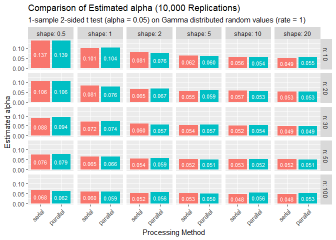

Parallel Computing: Monte Carlo Study for t-test
================
Chien-Lan Hsueh
2022-06-11

- [Packages](#packages)
- [Implemente helper functions to do a
  t-test](#implemente-helper-functions-to-do-a-t-test)
  - [Test Case 1:](#test-case-1)
  - [Test Case 2:](#test-case-2)
  - [Test Case 3:](#test-case-3)
- [Monte Carlo Study](#monte-carlo-study)
- [Parallel Computing](#parallel-computing)

## Packages

The following packages are used in this project:

- `scales`: formats and labels scales nicely for better visualization
- `tidyverse`: includes collections of useful packages like `dplyr`
  (data manipulation), `tidyr` (tidying data), `ggplots` (creating
  graphs), etc.
- `glue`: offers interpreted string literals for easy creation of
  dynamic messages and labels
- `parallel`: parallel computation, including by forking (taken from
  package multicore), by sockets (taken from package snow) and
  random-number generation

``` r
if (!require("pacman")) utils::install.packages("pacman", dependencies = TRUE)
```

    ## Loading required package: pacman

``` r
pacman::p_load(
  scales,
    tidyverse,
    glue,
    parallel
)
```

## Implemente helper functions to do a t-test

> Write a function to calculate the test statistic.
>
> - Inputs should be a vector of numeric data and the mean value to
>   compare against
>   ()
> - The output should be the calculated
>   
>   value

``` r
# a helper function to calculate t statistic
t_statistic <- function(x, mu){
  (mean(x) - mu) / ( sd(x)/sqrt(length(x)) )
}
```

> Write a function to determine whether you reject
> 
> for fail to reject it.
>
> - Inputs should be the test statistic value, the sample size, the
>   significance level
>   (),
>   and the direction of the alternative hypothesis (left, right, or
>   two-sided).
> - The output should be a `TRUE` or `FALSE` value depending on whether
>   or not you reject the null hypothesis. Note: `qt()` will give
>   quantiles from the t-distribution.

In an one-sample t test, whether the null hypothesis is rejected or not
can be determined either by comparing the p-value to the significance
level or by comparing the observed and critical statistics. In the
function definition below, we decide what type of the test is (1: left,
2: right and 3: two-sided) and then calculate p-value and statistics
critical value accordingly.

A wrapper function is also defined to perform the t test easier.

``` r
# a helper function to determine whether to reject the null hypothesis
t_test_reject_H0 <- 
  function(t_statistic, size, direction = "two-sided", alpha = 0.05, verbose = FALSE){
  
  # check if test direction is valid
  directions <- c("left", "right", "two-sided")
  if(!(direction %in% directions)) {
    # invalid test direction
    print("Invalid test direction!")
    result(NA)
  } 
  
  # degrees of freedom for 1-sample t-test
  df <-  size - 1
  
  # test type based on direction: (1: left, 2: right and 3: two-sided)
  test_type <- which(direction == directions)
  
  # how many sides (tails)
  sides <- c(1, 1, 2)[test_type]
  
  # is the test comparison on the lower tail?
  lower.tail = c(T, F, t_statistic < 0)[test_type]
  
  # get p-value
  p_value <- pt(t_statistic, df, lower.tail = lower.tail) * sides
  
  # get critical t score
  t_critical <- qt(alpha/sides, df, lower.tail = lower.tail)
  
  # determine whether or not to reject the null hypothesis
  #   method 1: compare p-value to alpha
  reject_p <- p_value <= alpha
  #   method 2: compare t statistics to critical value
  reject <- ifelse(lower.tail, t_statistic < t_critical, t_statistic > t_critical)
  
  # print out test infomation and result if required
  if(verbose){
    # get a proper test name for print-out
    test_name <- direction %>% 
    paste0("-sided") %>% 
    str_sub(end = str_locate(., "-sided")[2])
  
    # print out test info and result
    print(glue(
      'One sample t-test: {test_name} with alpha = {alpha}\n',
      't = {round(t_statistic, 3)}, df = {size-1}, ',
      'p-value = {format(p_value, digits = 4, scientific = T)}\n',
      't* = {round(t_critical, 3)} for confidence level = {1-alpha}\n',
      'Result: {ifelse(reject, "Reject", "Fail to reject")} the null hypothese H0'
    ))
  }
  
  return(reject)
}

# a wrapper function to perform a t test: whether to reject the null hypothesis
t_test <- function(x, mu, ...){
  t_test_reject_H0(t_statistic(x, mu), length(x), ...)
}
```

> Test how well the function works! Use the built-in `iris` data set and
> run a few hypothesis tests. Using the data, determine if the true mean

### Test Case 1:

- sepal length differs from 5.5 (i.e. test
  
  vs
  
  and report whether or not we reject
  )

``` r
# use our helper function to do the t-test
t_test(iris$Sepal.Length, 5.5, verbose = TRUE)
```

    ## One sample t-test: two-sided with alpha = 0.05
    ## t = 5.078, df = 149, p-value = 1.123e-06
    ## t* = 1.976 for confidence level = 0.95
    ## Result: Reject the null hypothese H0

    ## [1] TRUE

``` r
# compare to t.test()
t.test(iris$Sepal.Length, mu = 5.5)
```

    ## 
    ##  One Sample t-test
    ## 
    ## data:  iris$Sepal.Length
    ## t = 5.078, df = 149, p-value = 1.123e-06
    ## alternative hypothesis: true mean is not equal to 5.5
    ## 95 percent confidence interval:
    ##  5.709732 5.976934
    ## sample estimates:
    ## mean of x 
    ##  5.843333

### Test Case 2:

> - sepal width is greater than 3.5

``` r
# use our helper function to do the t-test
t_test(iris$Sepal.Width, 3.5, direction = "right", verbose = TRUE)
```

    ## One sample t-test: right-sided with alpha = 0.05
    ## t = -12.439, df = 149, p-value = 1e+00
    ## t* = 1.655 for confidence level = 0.95
    ## Result: Fail to reject the null hypothese H0

    ## [1] FALSE

``` r
# compare to t.test()
t.test(iris$Sepal.Width, mu = 3.5, alternative = "greater")
```

    ## 
    ##  One Sample t-test
    ## 
    ## data:  iris$Sepal.Width
    ## t = -12.439, df = 149, p-value = 1
    ## alternative hypothesis: true mean is greater than 3.5
    ## 95 percent confidence interval:
    ##  2.998429      Inf
    ## sample estimates:
    ## mean of x 
    ##  3.057333

### Test Case 3:

> - petal length is less than 4

``` r
# use our helper function to do the t-test
t_test(iris$Petal.Length, 4, direction = "left", verbose = TRUE)
```

    ## One sample t-test: left-sided with alpha = 0.05
    ## t = -1.679, df = 149, p-value = 4.763e-02
    ## t* = -1.655 for confidence level = 0.95
    ## Result: Reject the null hypothese H0

    ## [1] TRUE

``` r
# compare to t.test()
t.test(iris$Petal.Length, mu = 4, alternative = "less")
```

    ## 
    ##  One Sample t-test
    ## 
    ## data:  iris$Petal.Length
    ## t = -1.679, df = 149, p-value = 0.04763
    ## alternative hypothesis: true mean is less than 4
    ## 95 percent confidence interval:
    ##      -Inf 3.996566
    ## sample estimates:
    ## mean of x 
    ##     3.758

## Monte Carlo Study

> A Monte Carlo Simulation is one where we generate (pseudo) random
> values using a random number generator and use those random values to
> judge properties of tests, intervals, algorithms, etc.
>
> Generate data from a `gamma` distribution using different shape
> parameters and sample sizes. We’ll then apply the t-test functions
> from above and see how well the
> 
> level is controlled under the incorrect assumption about the
> distribution our data is generated from.
>
> Pseudocode:
>
> - generate a random sample of size n from the gamma distribution with
>   given
>   
>   and
>   
>   parameters specified (see `rgamma()`)
> - find the test statistic using the actual mean of the randomly
>   generated data for
>   
>   (i.e
>    -
>   implying the null hypothesis
>   
>   is true)
> - using the given alternative (left, right, or both) determine whether
>   you reject or not
> - repeat many times
> - observe the proportion of rejected null hypothesis from your
>   repetitions (these are all incorrectly rejected since the null
>   hypothesis is true). This proportion is our Monte Carlo estimate of
>   the
>   
>   value under this data generating process.
>
> Write code to do the above when sampling from a gamma distribution
> with
> 
> and
> 
> with a sample size of
> 
> for a two-sided test. Use the `replicate()` function (a wrapper for
> the `sapply()` function) to do the data generation and determination
> of reject/fail to reject with relative ease (with the number of
> replications being 10000)! Then find the mean of the resulting
> `TRUE/FALSE` values as your estimated
> 
> level under these assumptions.

We first set up the parameters including sample size, shape and rate to
generate random values from the gamma distribution. Then we perform a
one-sample two-sided t test with the significance level of

and repeat this process for 10,000 times to get an estimated
.

``` r
# the simulation parameters: sample size, shape and rate of the Gamma distribution
X <- list(n = 10, shape = 0.5, rate = 1)

# execute simulation for 10000 times
alpha_estimated <-
  replicate(10000, t_test(rgamma(X$n, X$shape, X$rate), mu =  X$shape * X$rate)) %>% 
  mean()

print(glue(
  "The estimated alpha is {alpha_estimated}\n",
  "The significance level used in the t test is 0.05."
))
```

    ## The estimated alpha is 0.1331
    ## The significance level used in the t test is 0.05.

An incorrect assumption about the distribution results in big estimated
alpha.

## Parallel Computing

> Do the above Monte Carlo simulation for several settings of sample
> size, shape, and rate parameter. As it turns out, we really don’t need
> to worry about the rate parameter, it just scales the distribution.
>
> - create a vector of sample size values (10, 20, 30, 50, 100)
> - create a vector of shape values (0.5, 1, 2, 5, 10, 20)
> - create a rate vector with the value 1
>
> We want to be able to use `parLapply()` to execute the above Monte
> Carlo study for combinations of sample sizes and shape values (with
> rate always 1). To use `parLapply()`, we need to pass
>
> - our cluster set up via `makeCluster()`
>   - We must also use `clusterExport()` function to pass a list of our
>     functions that we created
>   - If you use any packages, you’ll need to use `clusterEvalQ()` to
>     pass the package
> - `X` a list we will parallelize our computations over (each list
>   element would be a combination of sample size and shape parameter)
> - `fun` a function that does the replication of gamma samples, finds
>   the decisions for each sample, and calculates and returns the
>   proportion
> - Create a function to do this that just uses the `replicate()` and
>   `mean()` code above
> - any other arguments needed for our functions to run (for instance
>   )

Set up the parameter grid as a list in which each list element is a
combination of sample size and shape parameter:

``` r
# parameters 
sample_sizes <- c(10, 20, 30, 50, 100)
shape_values <- c(0.5, 1, 2, 5, 10, 20)
rate_values <- c(1)

# set up a list of the parameter grid
X <- expand_grid(sample_sizes, shape_values, rate_values) %>% 
  `names<-`(c("n", "shape", "rate")) %>% 
  split(., 1:nrow(.)) %>% 
  unname() %>% 
  lapply(as.list)

# check if the number of combinations is correct
length(X) == prod(sapply(list(sample_sizes, shape_values, rate_values), length))
```

    ## [1] TRUE

``` r
# take a look to ensure the setup is correct
X[1:3]
```

    ## [[1]]
    ## [[1]]$n
    ## [1] 10
    ## 
    ## [[1]]$shape
    ## [1] 0.5
    ## 
    ## [[1]]$rate
    ## [1] 1
    ## 
    ## 
    ## [[2]]
    ## [[2]]$n
    ## [1] 10
    ## 
    ## [[2]]$shape
    ## [1] 1
    ## 
    ## [[2]]$rate
    ## [1] 1
    ## 
    ## 
    ## [[3]]
    ## [[3]]$n
    ## [1] 10
    ## 
    ## [[3]]$shape
    ## [1] 2
    ## 
    ## [[3]]$rate
    ## [1] 1

Define the function to run the simulation and return the results:

``` r
getResults <- function(X){
  replicate(10000, t_test(rgamma(X$n, X$shape, X$rate), mu =  X$shape * X$rate)) %>% 
  mean()
}
```

Run Monte Carlo simulation with serial processing, and save results and
elapsed time:

``` r
# run tests - serial processing
time_ser <-
  system.time({
    results_ser <- lapply(X, getResults)}) %>% 
  print()
```

    ##    user  system elapsed 
    ##    7.21    0.09    7.36

Run Monte Carlo simulation with parallel processing, and save results
and elapsed time:

``` r
# Set up cores and clusters
cores <- detectCores()
cluster <- makeCluster(cores - 1)

# send packages and functions to cores on Windows
clusterExport(cluster, list("getResults", "t_test", "t_test_reject_H0", "t_statistic"))
clusterEvalQ(cluster, library(tidyverse)) %>% invisible()
clusterEvalQ(cluster, library(glue)) %>% invisible()

# run tests - parallel processing
time_par <-
  system.time({
    results_par <- parLapply(cluster, X = X, fun = getResults)}) %>% 
  print()
```

    ##    user  system elapsed 
    ##    0.03    0.00    1.31

``` r
# close the cluster
stopCluster(cluster)
```

Comparison of the results (estimated alpha) in a summary table and a
faceted plot:

``` r
# combine results and the run parameters into one data frame
result_summary <- bind_cols(
  as_tibble(bind_rows(X)), 
  tibble(alpha_serial = unlist(results_ser)),
  tibble(alpha_parallel = unlist(results_par)))
result_summary
```

<div class="kable-table">

|   n | shape | rate | alpha_serial | alpha_parallel |
|----:|------:|-----:|-------------:|---------------:|
|  10 |   0.5 |    1 |       0.1373 |         0.1387 |
|  10 |   1.0 |    1 |       0.1013 |         0.1041 |
|  10 |   2.0 |    1 |       0.0806 |         0.0760 |
|  10 |   5.0 |    1 |       0.0624 |         0.0597 |
|  10 |  10.0 |    1 |       0.0559 |         0.0544 |
|  10 |  20.0 |    1 |       0.0488 |         0.0548 |
|  20 |   0.5 |    1 |       0.1060 |         0.1056 |
|  20 |   1.0 |    1 |       0.0813 |         0.0765 |
|  20 |   2.0 |    1 |       0.0647 |         0.0667 |
|  20 |   5.0 |    1 |       0.0553 |         0.0591 |
|  20 |  10.0 |    1 |       0.0570 |         0.0533 |
|  20 |  20.0 |    1 |       0.0527 |         0.0526 |
|  30 |   0.5 |    1 |       0.0879 |         0.0945 |
|  30 |   1.0 |    1 |       0.0723 |         0.0743 |
|  30 |   2.0 |    1 |       0.0603 |         0.0566 |
|  30 |   5.0 |    1 |       0.0540 |         0.0567 |
|  30 |  10.0 |    1 |       0.0522 |         0.0540 |
|  30 |  20.0 |    1 |       0.0486 |         0.0486 |
|  50 |   0.5 |    1 |       0.0765 |         0.0787 |
|  50 |   1.0 |    1 |       0.0647 |         0.0656 |
|  50 |   2.0 |    1 |       0.0545 |         0.0588 |
|  50 |   5.0 |    1 |       0.0525 |         0.0510 |
|  50 |  10.0 |    1 |       0.0526 |         0.0524 |
|  50 |  20.0 |    1 |       0.0520 |         0.0515 |
| 100 |   0.5 |    1 |       0.0683 |         0.0617 |
| 100 |   1.0 |    1 |       0.0596 |         0.0588 |
| 100 |   2.0 |    1 |       0.0525 |         0.0562 |
| 100 |   5.0 |    1 |       0.0533 |         0.0499 |
| 100 |  10.0 |    1 |       0.0485 |         0.0559 |
| 100 |  20.0 |    1 |       0.0479 |         0.0530 |

</div>

``` r
result_summary %>% 
  pivot_longer(
    cols = starts_with("alpha"),
    names_to = "processing",
    names_prefix = "alpha_",
    values_to = "alpha") %>% 
  mutate(
    processing = factor(processing, levels = c("serial", "parallel"))
  ) %>% 
  ggplot(aes(x = processing, y = alpha, fill = processing)) +
  geom_col(show.legend = FALSE) +
  geom_text(
    aes(label = format(alpha, digits = 2)), 
    color = "white",
    size = 3, 
    position = position_stack(vjust = 0.5)) +
  facet_grid(
    n ~ shape, 
    labeller = labeller(.rows = label_both, .cols = label_both)) +
  theme(axis.text.x = element_text(angle = 45, hjust=1)) + 
  labs(
    title = "Comparison of Estimated alpha (10,000 Replications)",
    subtitle = glue(
      "1-sample 2-sided t test (alpha = 0.05) ",
      "on Gamma distributed random values (rate = 1)"),
    x = "Processing Method",
    y = "Estimated alpha",
    fill = NULL)
```

<!-- -->

The estimated alpha decreases to 0.05 when sample size increases which
is explained by CLT. It also decreases with larger shape value. This
agrees with the fact that the Gamma distribution converges to the normal
distribution for a large shape parameter.

At last, let’s compare the computing time used (seconds) by both
methods:

``` r
time_summary <- bind_rows(
  c(seq_or_par = "Sequential", time_ser), 
  c(seq_or_par = "Parallel", time_par)) %>% 
  mutate_at(2:4, as.numeric)
time_summary
```

<div class="kable-table">

| seq_or_par | user.self | sys.self | elapsed | user.child | sys.child |
|:-----------|----------:|---------:|--------:|:-----------|:----------|
| Sequential |      7.21 |     0.09 |    7.36 | NA         | NA        |
| Parallel   |      0.03 |     0.00 |    1.31 | NA         | NA        |

</div>

``` r
print(glue(
  "In this study, the parallel processing is ",
  "{percent((time_ser[3]- time_par[3])/time_ser[3], 0.01)} ",
  "faster than the sequential processing."
))
```

    ## In this study, the parallel processing is 82.20% faster than the sequential processing.
