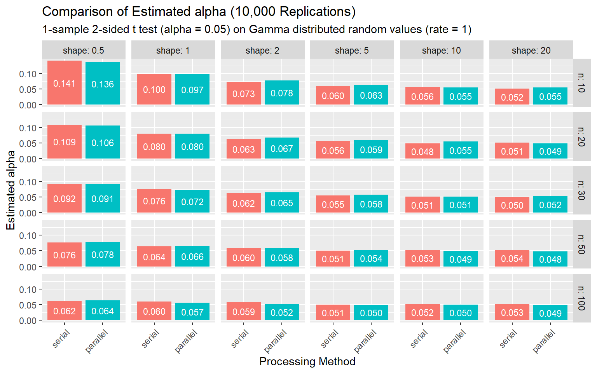
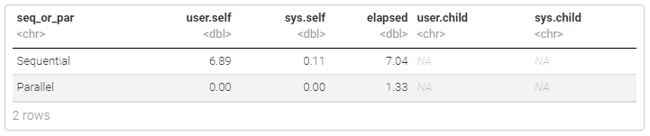

# Parallel Computing: Monte Carlo Study for t-test

Implement one-sample t-test and execute a Monte Carlo study to compare sequential and parallel computing performance.

[Project report](https://rpubs.com/clh2021/1119962)

Key features:

- t-test
- Monte Carlo Simulation 
- Gamma Distribution
- Parallel Computing using ``
- R code benchmarks

R packages used:

- `scales`: formats and labels scales nicely for better visualization
- `tidyverse`: includes collections of useful packages like `dplyr` (data manipulation), `tidyr` (tidying data),  `ggplots` (creating graphs), etc.
- `glue`: offers interpreted string literals for easy creation of dynamic messages and labels
- `parallel`: parallel computation, including by forking (taken from package multicore), by sockets (taken from package snow) and random-number generation

## Project Report

[Project report](https://rpubs.com/clh2021/1119962) ([Github Markdown](./Parallel_Computing.md))([R Markdown](./Parallel_Computing.Rmd))

The analysis results with all theoretical backgrounds and math derivations are included.

Author: Chien-Lan Hsueh (chienlan.hsueh at gmail.com)

## Overview and Project Goal

The project involves implementing t-test algorithm and perform a Monte Carlo simulation study in R using sequential and parallel computing manners. Compare and summarize the execution performance.

## Part 1 - Implemente helper functions to do a t-test

1. Write a function to calculate the test statistic.
   - Inputs should be a vector of numeric data and the mean value to compare against ($\mu_0$)
   - The output should be the calculated $t_{\text{obs}}$ value
1. Write a function to determine whether you reject $H_0$ for fail to reject it.
   - Inputs should be the test statistic value, the sample size, the significance level ($\alpha$), and the direction of the alternative hypothesis (left, right, or two-sided).
   - The output should be a `TRUE` or `FALSE` value depending on whether or not you reject the null hypothesis.
1. Test how well the function works (3 test cases)

## Part 2 - Monte Carlo Study

A Monte Carlo Simulation is one where we generate (pseudo) random values using a random number generator and use those random values to judge properties of tests, intervals, algorithms, etc.

Generate data from a `gamma` distribution using different shape parameters and sample sizes. We’ll then apply the t-test functions from above and see how well the $\alpha$ level is controlled under the incorrect assumption about the distribution our data is generated from.

## Part 3 - Parallel Computing

Do the above Monte Carlo simulation for several settings of sample size, shape, and rate parameter. As it turns out, we really don’t need to worry about the rate parameter, it just scales the distribution.

- create a vector of sample size values (10, 20, 30, 50, 100)
- create a vector of shape values (0.5, 1, 2, 5, 10, 20)
- create a rate vector with the value 1
 
Use `parLapply()` to execute the above Monte Carlo study for combinations of sample sizes and shape values (with rate always 1).

Finally compare the execution performance using sequential and parallel manners.

